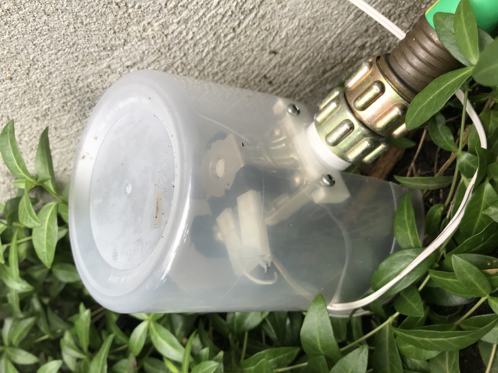
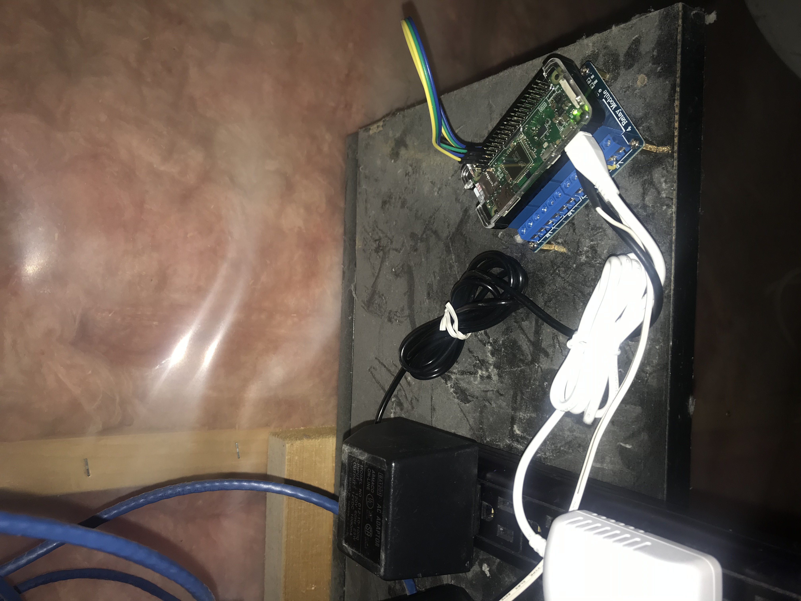

# sprinkler-pi
raspberry pi controller garden sprinkler
I also use this project to control my fireplace with a simple relay.
But I've hooked up IFTTT to my raspi webserver so I can ask alexa to 
turn on my fireplace.

sudo apt-get install python3-pip 
sudo pip3 install RPi.GPIO 
sudo pip3 install flask 
sudo pip3 install flask-socketio 
sudo pip3 install eventlet 

python3 app.py 
http://<raspi ip>:5001 

START AS SERVICE 
sudo vi /etc/systemd/system/sprinkler.service 
[Unit] 
Description=sprinkler 
After=network-online.target 
[Service] 
ExecStart=/home/pi/sprinkler-pi/app.py 
[Install] 
WantedBy=multi-user.target 

add shebang to app.py  (#!/usr/bin/python3) 
chmod +x ~/sprinkler-pi/app.py 

sudo systemctl daemon-reload 
sudo systemctl enable sprinkler 
sudo systemctl restart sprinkler 
sudo systemctl status sprinkler.service 

# alexa and pi
python3 -m pip install Flask-Ask 
pip3 install --upgrade setuptools 
pip3 install 'cryptography<2.2' 
pip3 install werkzeug==0.16.0 

# setup HTTPS
we need to run https in order for amazon's alexa skills to talk to the pi.
We will be portforwarding using our domain - so we can use real certs rather than self-signed ones.
Should be able to just copy the certs from our domain server and use them on the pizero.

but here is an article explaining how to generate self signed certs
https://blog.miguelgrinberg.com/post/running-your-flask-application-over-https

#ngrok
An alternative is to use ngrok.  https://dashboard.ngrok.com/get-started/setup
Instantly create a public HTTPS url for a website running locally on your development machine.
ngrok offloads TLS so you don't have to worry about your configuration.

enable port forwarding on your router so the pi is accessible from outside

# Alexa skills
using alexa skills can theoretically work, but it's far too complicated and finicky
when dealing with your skill invocation phrase and what 'slots' you want to use for
your skill.  I found that you couldn't define a desirable invocation name nor slot (on/off)
in order to have it work nicely. On top of that, getting the skill to work in canada on
my alexa devices proved troublesome.

# IFTTT
using IFTTT is much, much simpler. no ngrok. no https (if you want that)
goto ifttt.com
create a new applet
choose alexa as the 'if' and pick whatever phrase you like ("fireplace")
choose webhooks as the 'then' and have it point to your raspberry pi
once this is set up, you can simply say "alexa, trigger fireplace"
