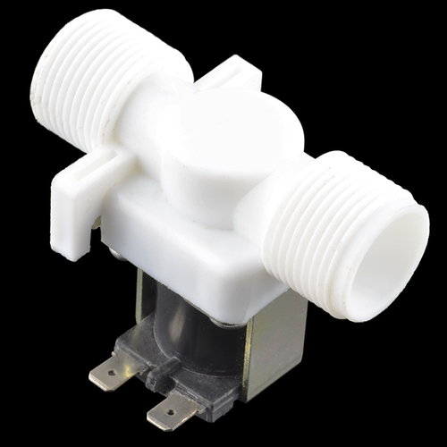

# sprinkler-pi
raspberry pi controller garden sprinkler

sudo apt-get install python3-pip
sudo pip3 install RPi.GPIO
sudo pip3 install flask
sudo pip3 install flask-socketio

python3 app.py
http://<raspi ip>:5000
  
